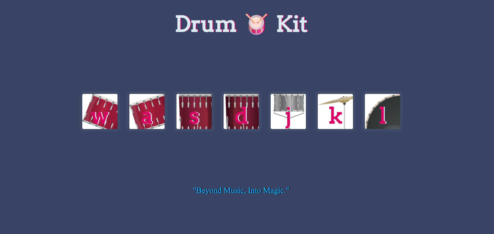

# 🥁 Drum_Kit  

An interactive **Drum Kit** built using HTML, CSS, and JavaScript.  
This web app lets you play various drum sounds using either your keyboard or mouse clicks, making it a fun and educational rhythm experience.

---

## 🌐 Live Demo  
🔗 [Drum Kit](https://adityamahekar.github.io/Drum_Kit/)

---

## 🚀 Features  
- 🎹 Play drums using keyboard keys  
- 🖱️ Clickable drum images  
- 🔊 Real-time sound playback (kick, snare, toms, crash)  
- 👨‍🎤 Great for beginners learning percussion sounds  
- 🎨 Simple and responsive design  

---

## 🛠️ Tech Stack  
- **Frontend**: HTML, CSS, JavaScript  
- **Deployment**: GitHub Pages  

---

## 📷 Gallery  

| Drum Kit UI |
|-------------|
|  |

---
